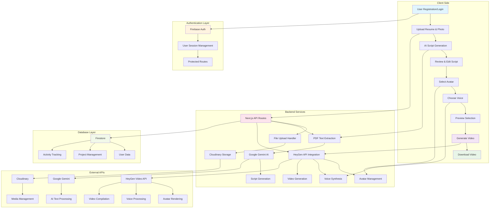
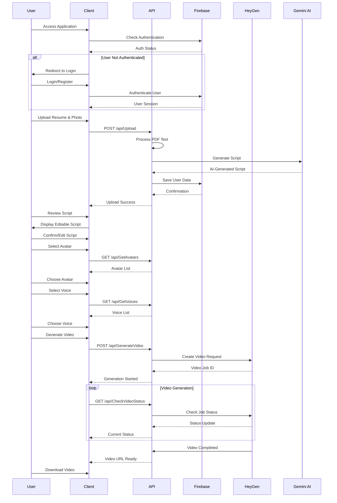

# 🎬 Resume2Video - AI-Powered Video Resume Creator

[](https://nextjs.org/)
[](https://reactjs.org/)
[](https://firebase.google.com/)
[](https://tailwindcss.com/)
[](https://www.typescriptlang.org/)

Transform your traditional resume into an engaging AI-powered video presentation that stands out to employers. Resume2Video leverages cutting-edge AI technology to create professional video resumes with realistic avatars, natural voice synthesis, and stunning visual presentations.

## 🌟 Features

### 🤖 AI-Powered Technology
- **Smart Script Generation**: Automatically converts resume content into engaging video scripts
- **Professional AI Avatars**: 50+ studio-quality digital presenters
- **Natural Voice Synthesis**: Multi-language support (English, Tamil, Hindi)
- **Intelligent Content Analysis**: Advanced PDF parsing and text extraction

### 🎨 Modern UI/UX
- **Glassmorphism Design**: Beautiful transparent elements with backdrop blur effects
- **Advanced Animations**: Mouse-following gradients, floating particles, and smooth transitions
- **Responsive Design**: Optimized for all devices and screen sizes
- **Dark Theme**: Professional dark interface with gradient accents

### 🔒 Security & Performance
- **Firebase Authentication**: Secure user management and session handling
- **Firestore Database**: Real-time data synchronization and storage
- **Cloudinary Integration**: Optimized media storage and delivery
- **Performance Caching**: In-memory caching with TTL for faster API responses

### 🚀 Advanced Features
- **Real-time Progress Tracking**: Live video generation status updates
- **Script Customization**: Full editing capabilities for generated scripts
- **Multiple Export Options**: High-quality video downloads
- **User Dashboard**: Comprehensive analytics and project management

## 🏗️ Architecture & Flow



## 🛠️ Technology Stack

### Frontend
- **Framework**: Next.js 15.2.1 with App Router
- **UI Library**: React 19.0.0 with Hooks
- **Styling**: Tailwind CSS 4.0 with custom components
- **Icons**: Lucide React, React Icons, Radix UI Icons
- **Animations**: Custom CSS animations with Tailwind
- **State Management**: React Hooks (useState, useEffect)

### Backend
- **Runtime**: Node.js with Next.js API Routes
- **Authentication**: Firebase Auth with session management
- **Database**: Firestore with real-time synchronization
- **File Storage**: Cloudinary for media management
- **PDF Processing**: PDF.js for text extraction
- **AI Integration**: Google Gemini for script generation

### External Services
- **Video Generation**: HeyGen API for avatar and voice synthesis
- **Cloud Storage**: Cloudinary for optimized media delivery
- **Analytics**: Custom analytics with Firestore
- **Monitoring**: Built-in error handling and logging

## 📋 Prerequisites

Before running this project, make sure you have:

- **Node.js** 18.0 or higher
- **npm** or **yarn** package manager
- **Firebase** project with Authentication and Firestore enabled
- **Cloudinary** account for media storage
- **HeyGen API** credentials for video generation
- **Google AI** API key for Gemini integration

## 🚀 Installation & Setup

### 1. Clone the Repository
```bash
git clone https://github.com/Nithin9585/Resume2Video.git
cd Resume2Video/resume2video
```

### 2. Install Dependencies
```bash
npm install
# or
yarn install
```

### 3. Environment Configuration

Create a `.env.local` file in the root directory:

```env
# Firebase Configuration
NEXT_PUBLIC_FIREBASE_API_KEY=your_firebase_api_key
NEXT_PUBLIC_FIREBASE_AUTH_DOMAIN=your_project.firebaseapp.com
NEXT_PUBLIC_FIREBASE_PROJECT_ID=your_project_id
NEXT_PUBLIC_FIREBASE_STORAGE_BUCKET=your_project.appspot.com
NEXT_PUBLIC_FIREBASE_MESSAGING_SENDER_ID=your_sender_id
NEXT_PUBLIC_FIREBASE_APP_ID=your_app_id

# Firebase Admin (Server-side)
FIREBASE_ADMIN_PRIVATE_KEY=your_private_key
FIREBASE_ADMIN_CLIENT_EMAIL=your_client_email
FIREBASE_ADMIN_PROJECT_ID=your_project_id

# Cloudinary Configuration
CLOUDINARY_CLOUD_NAME=your_cloud_name
CLOUDINARY_API_KEY=your_api_key
CLOUDINARY_API_SECRET=your_api_secret

# HeyGen API Configuration
HEYGEN_API_KEY=your_heygen_api_key
HEYGEN_API_URL=https://api.heygen.com/v2

# Google AI Configuration
GOOGLE_AI_API_KEY=your_google_ai_key

# Application URL
NEXT_PUBLIC_APP_URL=http://localhost:3000
```

### 4. Firebase Setup

1. **Create a Firebase Project**:
   - Go to [Firebase Console](https://console.firebase.google.com/)
   - Create a new project
   - Enable Authentication and Firestore Database

2. **Configure Authentication**:
   - Enable Email/Password authentication
   - Configure authorized domains

3. **Setup Firestore Rules**:
```javascript
rules_version = '2';
service cloud.firestore {
  match /databases/{database}/documents {
    match /userdata/{userId} {
      allow read, write: if request.auth != null && request.auth.uid == userId;
    }
  }
}
```

### 5. Run the Development Server

```bash
npm run dev
# or
yarn dev
```

Open [http://localhost:3000](http://localhost:3000) in your browser.
- **Start the Production Server**: Run the production server with:
  ```bash
  npm start
  ```

## Project Structure

- **src/app**: Contains the main application logic and API routes.
- **src/components**: Reusable UI components.
- **src/lib**: Utility functions and database connection logic.
- **public**: Static assets like images and icons.

## 🔄 Application Workflow

### User Journey Flow



## 🔧 API Endpoints

### Authentication
- `POST /api/auth/login` - User authentication
- `POST /api/auth/register` - User registration
- `POST /api/auth/logout` - User logout

### File Management
- `POST /api/Upload` - Upload resume and profile picture
- `GET /api/files/[id]` - Retrieve uploaded files

### AI Processing
- `POST /api/GenerateScript` - Generate AI script from resume
- `GET /api/GetAvatars` - Fetch available avatars
- `GET /api/GetVoices` - Fetch available voices

### Video Generation
- `POST /api/GenerateVideo` - Start video generation
- `GET /api/CheckVideoStatus` - Check video generation status
- `GET /api/video/[id]` - Download generated video

## 🚀 Deployment Guide

### Production Deployment

1. **Build the Application**:
```bash
npm run build
```

2. **Environment Setup**:
   - Configure production environment variables
   - Set up Firebase production project
   - Configure Cloudinary for production
   - Update HeyGen API endpoints

3. **Deploy to Vercel** (Recommended):
```bash
npm install -g vercel
vercel --prod
```

## 🆘 Troubleshooting

### Common Issues

#### 1. Firebase Authentication Errors
```bash
Error: Firebase config is not defined
```
**Solution**: Ensure all Firebase environment variables are properly set in `.env.local`

#### 2. HeyGen API Failures
```bash
Error: Avatar not found
```
**Solution**: Verify HeyGen API credentials and check avatar availability

#### 3. PDF Processing Issues
```bash
Error: PDF text extraction failed
```
**Solution**: Ensure PDF contains selectable text (not image-based)

## 🤝 Contributing

We welcome contributions to Resume2Video! Please follow these guidelines:

### Development Setup
1. Fork the repository
2. Create a feature branch: `git checkout -b feature/amazing-feature`
3. Make your changes and add tests
4. Commit your changes: `git commit -m 'Add amazing feature'`
5. Push to the branch: `git push origin feature/amazing-feature`
6. Open a Pull Request

## 📝 License

This project is licensed under the MIT License - see the [LICENSE](LICENSE) file for details.

## 📞 Support & Contact

### Getting Help
- **GitHub Issues**: Report bugs and request features
- **Documentation**: Comprehensive guides and API reference
- **Email Support**: contact@resume2video.com

---

<div align="center">

**Built with ❤️ by [Nithin9585](https://github.com/Nithin9585)**

[⭐ Star this repo](https://github.com/Nithin9585/Resume2Video) | [🐛 Report Bug](https://github.com/Nithin9585/Resume2Video/issues) | [✨ Request Feature](https://github.com/Nithin9585/Resume2Video/issues)

</div>
